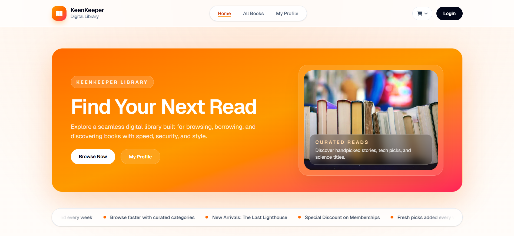

# KeenKeeper Library Hub

A modern, fully responsive digital library platform built for seamless book browsing, filtering, borrowing, and profile management.

## Live Demo

- **Production**: [keen-keeper-library-hub.vercel.app](https://keen-keeper-library-hub.vercel.app/)
- **Local development**: `http://localhost:3000`

## Overview

KeenKeeper Library Hub is a digital library application designed to help users discover, filter, and borrow books with ease. It provides a smooth, intuitive interface for managing reading profiles, tracking borrowed books, and maintaining personal wishlists. The latest version includes a refreshed landing page, featured books on the home screen, BetterAuth login, Google OAuth, and profile pages for borrowing history and wishlist management.

## Latest Updates

- New landing page hero and promotional sections
- Featured books displayed on the home page
- Dedicated books catalog with search and filtering
- BetterAuth-powered sign in, registration, and Google OAuth
- User profile page with borrowing and wishlist counts
- Borrowing history and wishlist routes under `my-profile`
- Production deployment on Vercel

## Screenshots



## Key Features

### 📚 Book Discovery & Management
- Browse a comprehensive catalog of books with advanced filtering
- Search books by title and category
- View detailed book information including descriptions and availability
- Real-time availability tracking for each book

### 👤 User Profiles & Authentication
- Secure user registration and login with email/password
- Google OAuth integration for quick sign-up
- User profile management with customizable information
- Profile photo support via image URLs
- Account creation date tracking

### 📖 Borrowing System
- Add books to borrowing queue
- Track borrowed books with borrowing history
- View available copies in real-time
- Visual feedback for borrowed items

### ❤️ Wishlist Management
- Add books to personal wishlist
- Track wishlist items separately from borrowed books
- Easy wishlist viewing and management

### 📱 Responsive Design
- **Fully responsive** on mobile (320px+), tablet (640px+), and desktop (1024px+)
- Mobile-optimized navigation with hamburger menu
- Flexible grid layouts that adapt to screen size
- Touch-friendly interface elements
- Optimized performance across all devices

### 🎨 Modern UI/UX
- Beautiful gradient backgrounds and modern design system
- Smooth animations and transitions
- Toast notifications for user feedback
- Accessible color schemes and typography
- Rounded cards and modern spacing

### 🔐 Security
- Password validation (minimum 8 characters, uppercase letter required)
- Secure authentication with BetterAuth
- Protected routes for authenticated users
- Encrypted session management

## NPM Packages

### Production Dependencies
| Package | Version | Purpose |
|---------|---------|---------|
| `next` | 16.2.4 | React framework with SSR and static generation |
| `react` | 19.2.4 | UI library for building interactive components |
| `react-dom` | 19.2.4 | React package for working with the DOM |
| `tailwindcss` | 4 | Utility-first CSS framework for responsive design |
| `@tailwindcss/postcss` | 4 | PostCSS plugin for Tailwind CSS |
| `daisyui` | 5.5.19 | Component library built on Tailwind CSS |
| `react-icons` | 5.6.0 | Icon library with popular icon sets (FA6, IoT, etc.) |
| `animate.css` | 4.1.1 | CSS animation library for smooth transitions |
| `better-auth` | 1.6.9 | Authentication library with social OAuth support |
| `mongodb` | 7.2.0 | MongoDB driver for Node.js |

### Development Dependencies
| Package | Version | Purpose |
|---------|---------|---------|
| `eslint` | 9 | JavaScript linting and code quality |
| `eslint-config-next` | 16.2.4 | ESLint configuration optimized for Next.js |
| `babel-plugin-react-compiler` | 1.0.0 | Advanced React compilation and optimization |
| `postcss` | Latest | CSS transformation tool |

## Project Structure

```
online-book-borrowing-platform/
├── src/
│   ├── app/                      # Next.js App Router pages
│   │   ├── api/                  # API routes
│   │   ├── books/                # Books listing and detail pages
│   │   ├── login/                # Login page and form
│   │   ├── register/             # Registration page and form
│   │   ├── my-profile/           # User profile, history, and wishlist
│   │   ├── layout.js             # Root layout component
│   │   ├── page.js               # Home page
│   │   ├── globals.css           # Global styles
│   │   └── loading.js            # Loading states
│   ├── components/               # Reusable React components
│   │   ├── site-header.js        # Navigation header with mobile menu
│   │   ├── site-footer.js        # Footer component
│   │   ├── back-button.js        # Navigation back button
│   │   ├── toast.js              # Toast notification component
│   │   └── profile-book-list.js  # Book list in profile
│   ├── lib/                      # Utility functions and helpers
│   │   ├── auth.js               # Authentication server functions
│   │   ├── auth-client.js        # Authentication client functions
│   │   ├── mongodb.js            # MongoDB connection
│   │   ├── books.js              # Book data operations
│   │   └── book-session.js       # Session storage for book data
│   ├── data/                     # Static data
│   │   └── books.json            # Sample book catalog
│   └── assets/                   # Images and static assets
├── public/                       # Public static files
├── package.json                  # Dependencies and scripts
├── next.config.mjs               # Next.js configuration
├── tailwind.config.mjs            # Tailwind CSS configuration
├── postcss.config.mjs            # PostCSS configuration
├── jsconfig.json                 # JavaScript compiler options
├── eslint.config.mjs             # ESLint configuration
└── README.md                     # This file
```

## Getting Started

### Prerequisites
- Node.js 16.x or higher
- npm or yarn package manager
- MongoDB instance (local or cloud)

### Installation

1. Clone the repository:
```bash
git clone <repository-url>
cd online-book-borrowing-platform
```

2. Install dependencies:
```bash
npm install
```

3. Set up environment variables:
Create a `.env.local` file in the root directory with:
```
MONGODB_URI=<your-mongodb-connection-string>
MONGODB_DB=online-book-borrowing-platform
BETTER_AUTH_SECRET=<your-secret-key>
BETTER_AUTH_URL=http://localhost:3000
NEXT_PUBLIC_BETTER_AUTH_URL=http://localhost:3000
GOOGLE_CLIENT_ID=<your-google-client-id>
GOOGLE_CLIENT_SECRET=<your-google-client-secret>
```

4. Run the development server:
```bash
npm run dev
```

5. Open your browser and navigate to:
```
http://localhost:3000
```

## Available Scripts

```bash
npm run dev      # Start development server with hot reload
npm run build    # Build for production
npm start        # Start production server
npm run lint     # Run ESLint for code quality checks
```

## Features in Detail

### Authentication Flow
- Users can register with email, password, and profile photo URL
- Password requirements: minimum 8 characters with at least one uppercase letter
- Google OAuth integration for quick registration/login
- Secure session management with BetterAuth

### Book Management
- Books are stored in MongoDB with availability tracking
- Real-time updates to borrowed and available counts
- Session-based storage for user's borrowed books and wishlist
- Fallback to local JSON data for demo purposes

### Responsive Design Breakpoints
- **Mobile**: 320px - 639px (xs breakpoint)
- **Small Mobile**: 640px - 767px (sm breakpoint)
- **Tablet**: 768px - 1023px (md breakpoint)
- **Desktop**: 1024px - 1279px (lg breakpoint)
- **Large Desktop**: 1280px+ (xl breakpoint)

### Accessibility
- Semantic HTML structure
- ARIA labels for interactive elements
- Keyboard navigation support
- Color contrast compliance
- Touch-friendly button sizes (minimum 44x44px on mobile)

## Performance Optimizations

- Next.js Image component for optimized images
- Dynamic imports for code splitting
- Tailwind CSS for minimal CSS bundle
- Session storage for instant user feedback
- Lazy loading for off-screen content

## Security Measures

- Password strength validation
- Secure authentication with BetterAuth
- Protected API routes
- CORS configuration for API endpoints
- Environment variables for sensitive data

## Future Enhancements

- Book ratings and reviews system
- Email notifications for book availability
- Advanced search with filters (author, publication date, rating)
- Social features (follow users, sharing recommendations)
- Reading progress tracking
- Personalized book recommendations
- Mobile app version (React Native)
- Dark mode support

## Contributing

Contributions are welcome! Please follow these steps:

1. Create a feature branch (`git checkout -b feature/amazing-feature`)
2. Commit your changes (`git commit -m 'Add amazing feature'`)
3. Push to the branch (`git push origin feature/amazing-feature`)
4. Open a Pull Request

## License

This project is licensed under the MIT License - see the LICENSE file for details.

## Support

For issues, questions, or suggestions, please open an issue on the repository or contact the development team.

---

**Last Updated**: May 1, 2026  
**Version**: 0.1.0  
**Status**: Development
